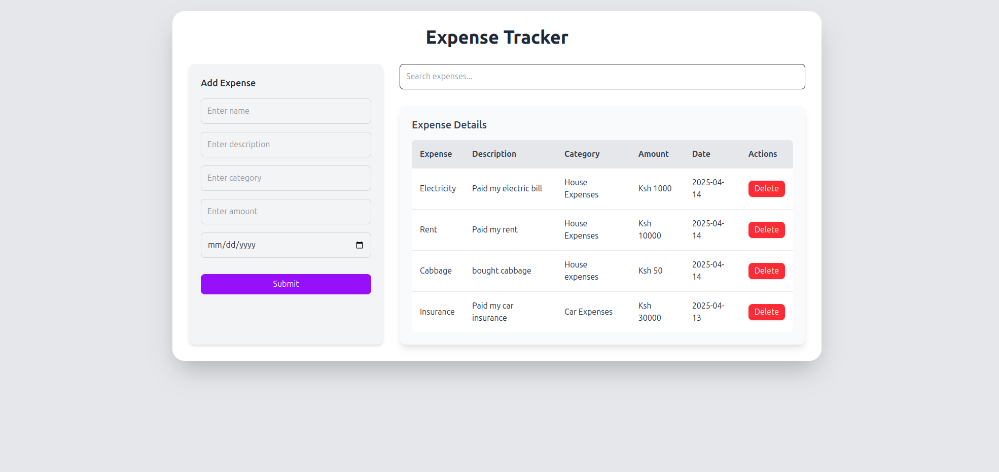

# Expense Tracker App

A modern and responsive expense tracker built with **React** and **Tailwind CSS**, designed to help users easily add, search, and manage their expenses.

---

## ✨ Features

- 🚀 Add and track your expenses with ease
- 🔍 Real-time search through expenses
- 📂 Categorize expenses for better tracking
- 📟 View detailed expense listings in a modern responsive table
- ❌ Delete unwanted expenses
- 🌈 Stylish and clean UI with Tailwind CSS

---

## 📸 Screenshots



---

## 🛠 Tech Stack

- **React** – Frontend framework
- **Tailwind CSS** – Styling and layout
- **Vite** – Fast build tool for modern frontend projects (if applicable)
- **JavaScript (ES6+)**

---

## 🧑‍💻 Getting Started

### 📦 Installation

1. **Clone the repository**

```bash
git clone https://github.com/yourusername/expense-tracker-react.git
cd expense-tracker-react
```

2. **Install dependencies**

```bash
npm install
```

3. **Run the development server**

```bash
npm run dev
```

> The app should be running on `http://localhost:5173` (or as shown in your terminal).

---

## 🗃 Project Structure

```
src/
├── components/
│   ├── ExpenseForm.jsx
│   ├── ExpenseTable.jsx
│   └── SearchBar.jsx
├── App.jsx
├── main.jsx
└── index.css
```

---

## 🎨 Customization

- 💡 Tailwind utility classes are used for layout and styling. You can easily update colors, spacing, fonts, etc., by editing `index.css` or directly in JSX classNames.
- 🖍 Change table or form layouts to suit your design needs.

---

## 📌 Future Improvements

- ✏️ Edit expense functionality
- 📊 Visual charts for spending analysis
- 🌃 Dark mode toggle
- ⏳ Pagination for large lists
- 📃 Persistent storage (e.g., localStorage or backend integration)

---

## 📄 License

This project is open-source and available under the [MIT License](LICENSE).

---


## 👨‍💻 Author

**[Newton Muhindi]**

> Feel free to fork this repo, raise issues, or suggest improvements!

